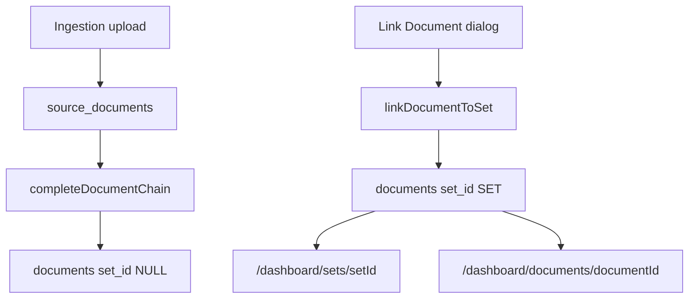

# Document ↔ Set Integration (Phase 3D.2)

**Date:** 2026-05-31  
**Strategy:** `documents.set_id` → `production_sets.id` (Document belongs to Set). No new relationship tables.

---

## PART 1 — Schema audit

| Item | Finding |
|------|---------|
| Column `documents.set_id` | **Exists** — UUID nullable (`20260531000100_constitutional_documents.sql`) |
| Column `documents.set_number` | **Exists** — nullable TEXT; populated on link |
| Index on `set_id` | **Added** — `20260531000400_documents_set_index.sql` (`idx_documents_set`) |
| Queried by set detail | `loadSetWorkspace()` → `.eq("set_id", setId)` |
| Queried by document detail | `getDocumentDetailWithSet()` → join `production_sets` on `set_id` |
| Upload chain | **Unchanged** — `completeDocumentChain()` still sets `set_id: null` (Test A) |

---

## Runtime flow

---

## PART 3 — Manual linking

- **UI:** Set detail → **Link Document** (replaces Coming Soon for that action)
- **Server:** `linkDocumentToSet(documentId, setId)` in `src/server/document-set-actions.ts`
- **Validation:** Same `production_id` on document and set
- **Writes:** `set_id`, `set_number` from `production_sets`

---

## Validation tests

| Test | Expected | Implementation |
|------|----------|----------------|
| **A** Upload document | Document exists; `set_id` null | No change to `document-chain.ts` |
| **B** Link document to set | `set_id` populated | `linkDocumentToSet` |
| **C** Open set | Document visible in sections | Existing `SetDocumentsPanel` + query |
| **D** Open document | Linked set or “No set assigned” | `/dashboard/documents/[documentId]` |

---

## Constitutional objects

| Object | Role |
|--------|------|
| `Document` | `documents` row; `setId` via `set_id` column |
| `ProductionSet` | `production_sets`; link target |
| `ImmutableSourceDocument` | Unchanged; upstream of Document |

---

## Files

**Created**

- `supabase/migrations/20260531000400_documents_set_index.sql`
- `src/lib/documents/document-set-queries.ts`
- `src/server/document-set-actions.ts`
- `src/components/set-detail/link-document-dialog.tsx`
- `src/components/documents/document-detail-view.tsx`
- `src/app/(main)/dashboard/documents/[documentId]/page.tsx`
- `docs/DOCUMENT_SET_INTEGRATION.md`

**Modified**

- `src/components/set-detail/set-operational-actions.tsx`
- `src/components/set-detail/set-detail-workspace.tsx`
- `src/components/set-detail/set-documents-panel.tsx`
- `src/app/(main)/dashboard/sets/[setId]/page.tsx`

**Tables modified (runtime)**

- `documents` — UPDATE `set_id`, `set_number` on manual link only

**Routes added**

- `/dashboard/documents/[documentId]`

---

*End.*
