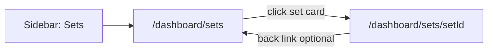

# Workspace Sprint 1 (Phase 3D — navigable flow)

**Objective:** First end-to-end navigable workspace flow without mock production data.

---

## Workspace flow

| Step | Route | Behavior |
|------|-------|----------|
| 1 | `/dashboard/sets` | Lists `production_sets` for `NEXT_PUBLIC_DEFAULT_PRODUCTION_ID` |
| 2 | `/dashboard/sets/[setId]` | Set Detail Workspace V1 (existing) |
| — | `/dashboard/sets/workspace` | Redirects to `/dashboard/sets` |

---

## Components

| Path | Role |
|------|------|
| `src/app/(main)/dashboard/sets/page.tsx` | Sets index (RSC) |
| `src/components/sets/sets-index.tsx` | Empty / error / grid |
| `src/components/sets/set-list-card.tsx` | Programa-style card → detail |
| `src/lib/sets/list-production-sets.ts` | Supabase list loader |
| `src/components/set-detail/*` | Unchanged detail workspace |

---

## Data rules

- **No mock sets** — grid only shows DB rows.
- **Empty:** “No sets in this production” when table exists but zero rows.
- **Unavailable:** migration/env missing → error empty state with operator message.
- Counts on cards: real `assets` / `scenes` row counts per `set_id`.

---

## Constitutional objects

- `ProductionSet` — list + detail root
- `Asset`, `Scene`, `Document` — detail only (unchanged)

---

## Out of scope (unchanged)

AI, extraction, search, uploads, generated outputs, forecasting, budget logic, new authorities, accounting tables, `/dashboard/sets` filters/search, set create/edit.

---

## Operator path

1. Env + migrations (including `20260531000300_set_workspace_tables.sql`).
2. Insert `production_sets` for default production UUID.
3. Sidebar **Production → Sets** → pick set → workspace.

---

## Missing from truncated spec

If your full Phase 3D prompt adds routes (e.g. department hub, ingestion link, breadcrumbs), paste the remainder and extend this doc.
